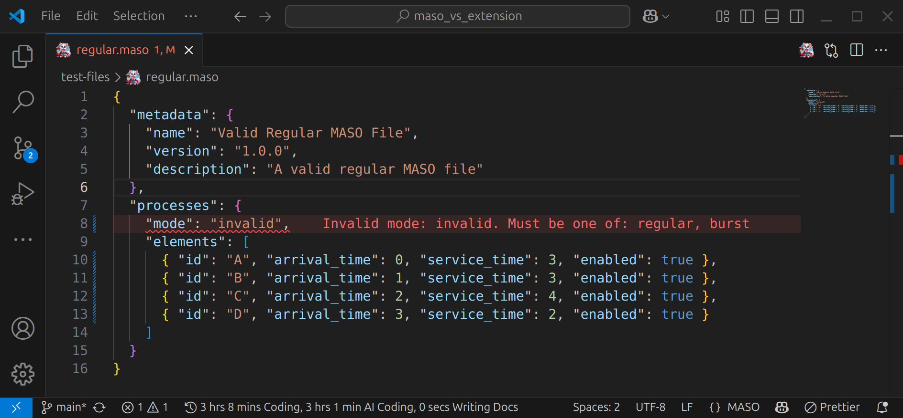

# MASO File Support

A VS Code extension that provides comprehensive support for `.maso` files with JSON validation, syntax highlighting, and real-time diagnostics.



_The extension automatically detects `.maso` files and provides real-time validation with detailed error messages, as shown above where an invalid mode "unknown" is highlighted with a clear diagnostic message._

## Features

- **Automatic recognition**: `.maso` files are automatically recognized as JSON
- **Schema validation**: Real-time validation of MASO file structure
- **Advanced diagnostics**: Detects structure errors, missing fields, and incorrect types
- **Specific validations**:
  - Unique process IDs
  - Non-negative times
  - Valid processing modes (regular, burst)
  - Mode-specific structure:
    - **Regular**: `service_time` required
    - **Burst**: `threads` with `bursts` of type `cpu` or `io`
- **Syntax highlighting**: MASO-specific keywords highlighted
- **Autocompletion**: Suggestions for valid fields

## MASO File Structure

### Regular Mode

```json
{
  "metadata": {
    "name": "Process Name",
    "version": "1.0.0",
    "description": "Process description"
  },
  "processes": {
    "mode": "regular",
    "elements": [
      {
        "id": "A",
        "arrival_time": 0,
        "service_time": 3,
        "enabled": true
      }
    ]
  }
}
```

### Burst Mode

```json
{
  "metadata": {
    "name": "Burst Mode Exercise",
    "version": "1.0.0",
    "description": "Processes with threads and bursts"
  },
  "processes": {
    "mode": "burst",
    "elements": [
      {
        "id": "P1",
        "arrival_time": 0,
        "enabled": true,
        "threads": [
          {
            "id": "T0",
            "enabled": true,
            "bursts": [
              {
                "type": "cpu",
                "duration": 3
              },
              {
                "type": "io",
                "duration": 2
              }
            ]
          }
        ]
      }
    ]
  }
}
```

## Requirements

- VS Code 1.102.0 or higher

## Configuration

This extension contributes the following settings:

- `maso.validation.enabled`: Enable/disable MASO file validation (default: `true`)
- `maso.validation.strictMode`: Enable strict validation mode (default: `false`)

## Commands

- `MASO: Validate File`: Manually validate the current MASO file

## Development Installation

1. **Clone this repository**

   ```bash
   git clone https://github.com/vicajilau/maso_vs_extension.git
   cd maso_vs_extension
   ```

2. **Install dependencies**

   ```bash
   npm install
   ```

3. **Compile the extension**

   ```bash
   npm run compile
   ```

4. **Test the extension**
   - Press `F5` to open a new VS Code window with the extension loaded
   - Create or open a `.maso` file to test the features

## Development and Commands

### Main Commands

- `npm run compile`: Compile TypeScript and run linting
- `npm run watch`: Compile in watch mode (recompiles automatically)
- `npm run test`: Run tests
- `npm run vsce:package`: Create VSIX package for distribution
- `npm run vsce:publish`: Publish to marketplace

### Development Workflow

1. **During active development:**

   ```bash
   npm run watch
   ```

   This maintains automatic compilation while you edit the code.

2. **To test changes:**

   - Press `F5` to launch extension in debug mode
   - Use `Ctrl+Shift+F5` to reload the extension window

3. **Before committing:**

   ```bash
   npm run compile  # Verify everything compiles without errors
   ```

4. **To create a new version:**

   ```bash
   # 1. Compile and verify
   npm run compile

   # 2. Create VSIX package
   npm run vsce:package

   # 3. Install locally to test
   code --install-extension maso-file-support-0.0.1.vsix
   ```

### Why compile before packaging?

- **TypeScript → JavaScript**: Source code is in TypeScript but VS Code runs JavaScript
- **Bundling**: esbuild combines all files into a single optimized `dist/extension.js`
- **Verification**: Type checking and linting run to detect errors
- **Optimization**: Code is minified and optimized for production
- **VSIX package**: Only includes compiled JavaScript, not source code

### Project Structure

```
maso_vs_extension/
├── src/
│   └── extension.ts          # Main extension code
├── syntaxes/
│   └── maso.tmGrammar.json   # Grammar for syntax highlighting
├── .github/
│   └── assets/               # Demo images and assets
│       ├── demo.png         # Demo screenshot
│       └── icon.png         # Extension icon
├── maso_files/               # Example files
│   ├── burst.maso           # Burst mode example
│   └── regular.maso         # Regular mode example
├── dist/                     # Compiled JavaScript (generated)
├── package.json              # Extension configuration
├── language-configuration.json # Language configuration
└── README.md
```

## Known Issues

There are currently no known issues. Please report any issues in the project repository.

## Version History

### 0.0.1

- Initial release
- Basic support for .maso files
- JSON schema validation
- Syntax highlighting
- Real-time diagnostics

---

## Contributing

Contributions are welcome! Please follow these steps:

### To Contribute

1. **Fork the repository**
2. **Create a branch for your feature:**

   ```bash
   git checkout -b feature/new-functionality
   ```

3. **Make changes and compile:**

   ```bash
   npm run compile  # Verify it compiles without errors
   ```

4. **Test the extension:**

   ```bash
   # Create test package
   npm run vsce:package

   # Install it locally
   code --install-extension maso-file-support-0.0.1.vsix
   ```

5. **Commit and push:**

   ```bash
   git add .
   git commit -m "feat: description of changes"
   git push origin feature/new-functionality
   ```

6. **Create Pull Request**

### Conventions

- **Commits**: Use [Conventional Commits](https://www.conventionalcommits.org/)

  - `feat:` for new features
  - `fix:` for bug fixes
  - `docs:` for documentation changes
  - `refactor:` for refactoring

- **Code**:
  - Use TypeScript with strict types
  - Run linting before commit
  - Add comments for complex logic

### Reporting Issues

If you find a bug or have a suggestion:

1. **Check** that a similar issue doesn't already exist
2. **Create a new issue** with:
   - Clear description of the problem
   - Steps to reproduce
   - Example `.maso` file if relevant
   - VS Code and extension version

## License

This project is under the MIT license.
